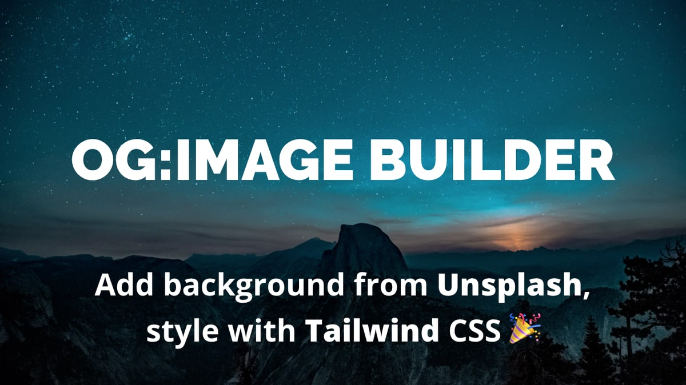

# Open Graph Image Builder

An experimental Web app project for making social cards with JAMstack + serverless architecture. Built with Gridsome, Vue and Tailwind CSS using [Tulip starter template](https://github.com/Uninen/gridsome-starter-tulip).

[Read about why and how](https://hoyci.unessa.net/2020/01/og-image-builder-part-1/) on my blog.

### Deploying

1. Fork this project
1. Run `yarn` to install dependencies and `yarn develop` to start the development server
1. Tweak your fonts, Tailwind config and meta data according to your needs. Also replace or remove the included Font Awesome kit as it's there only for testing convenience.
1. Copy `.env.example` as `.env` and get yourself an API key for Unsplash API to be able to use the Unsplash search. You also need to add this as a secret to ZEIT Now to be able to use it as an environment variable in production.
1. Deploy on ZEIT Now

Note: if you use some other hosting than ZEIT Now, implement `X-Content-Type-Options`, `X-Frame-Options`, `X-XSS-Protection` headers yourself (see examples in `now.json`).

### Some ideas for improvements

- Separate text position and styling (add easier position controls)
- Add ability to save and distribute (allow linking to) designs
- Implement image rendering with Puppeteer or similar proper backend tool
- Add an UI for adding layers
- Add possibility of using Markdown instead of HTML
- ~~Add ability to use plain color backgrounds instead of images~~ (done in 0.2.0)

### Never Asked Questions

- **But Why?** [I explain it in the blog post](https://hoyci.unessa.net/2020/01/og-image-builder-part-1/).
- **Isn't there (better) alternatives out there?** Yes. [I explain it in the blog post](https://hoyci.unessa.net/2020/01/og-image-builder-part-1/).
- **Is this based on some other project?** Nope. [I explain it in the blog post](https://hoyci.unessa.net/2020/01/og-image-builder-part-1/).
- **Where is the demo hosted?** On ZEIT Now. [I explain it in the blog post](https://hoyci.unessa.net/2020/01/og-image-builder-part-1/).

### Contributing and Thanks

First Big Thank You to Gridsome, Vue and Tailwind CSS teams for making these awesome open source tools. Thank You also to ZEIT Now for giving us a great service for developing and hosting our projects -- for free. Find a [list of contributors in the AUTHORS-file](./AUTHORS.md).

All contributions to this project are welcome as long as you follow [our code of conduct](CODE_OF_CONDUCT.md).

### Support Open Source development

[Follow @uninen on Twitter](https://twitter.com/uninen)!

If you want to support my open source on [GitHub](https://github.com/Uninen) and [GitLab](https://gitlab.com/uninen), you can buy me a 🍺 or ☕️ :)

